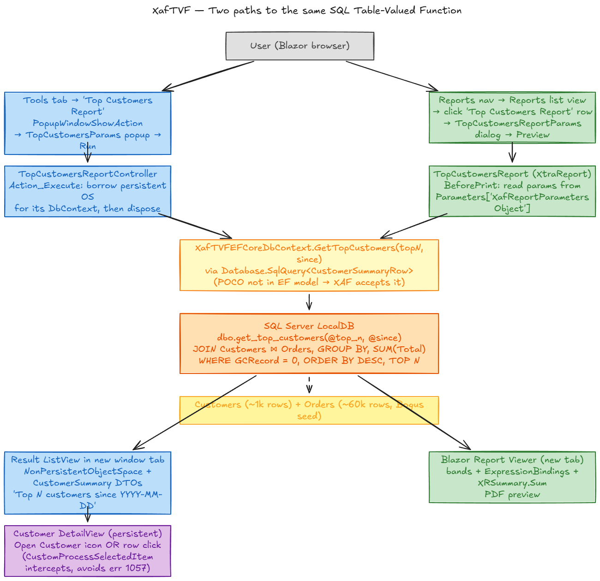

# XafTVF

A small DevExpress XAF sandbox that shows two end-to-end paths from a SQL **Table-Valued Function** into a XAF Blazor app — one as an in-app popup-driven result list, one as a predefined XtraReports report. Both paths share the same TVF, the same EF Core mapping, and the same non-persistent XAF DTO.

## Why this exists

A proof of concept. Aggregations over wide-fact tables (top-N by revenue, period-over-period rollups, ranked summaries) are often the slow spot in XAF apps when they're done the conventional way — load entities through `IObjectSpace`, then `LINQ → Sum/GroupBy` in C#. For the 60k-order seed in this spike, the difference between asking SQL Server to do the aggregation (which is what a TVF is *for*) and round-tripping every row to .NET is typically an order of magnitude or more, plus a much smaller working set and a much shorter UI wait. TVFs also keep the query reusable across UI, reports, and ad-hoc SQL.

The catch is that XAF doesn't ship a turn-key story for "SQL-side aggregate → XAF UI". The canonical EF Core TVF pattern (`HasDbFunction` + `HasNoKey().ToFunction(...)`) is rejected by XAF's `DBUpdater` because XAF auto-registers every mapped entity as a XAF business class and demands a key. So the spike works out a path that *does* fit XAF: query via `Database.SqlQuery<TRow>($"...")` against an unmapped POCO, project rows into a non-persistent XAF DTO inside a `NonPersistentObjectSpace`, and surface them through either a regular ListView or a predefined XtraReport — both fed from the exact same TVF.

What you get out the other end:
- **Speed**: aggregation runs server-side; only the top-N rows cross the wire.
- **Reuse**: one SQL function powers both the in-app result list and the report.
- **XAF-native UX**: same nav, same toolbar, same drill-through pattern as the rest of the app.

The full design notes live in [TVF_PLAN.md](./TVF_PLAN.md). This README is the orientation document.



---

## What's in the spike

`dbo.get_top_customers(@top_n, @since)` is a SQL TVF that joins `Customers ⋈ Orders`, filters `GCRecord = 0` (XAF's deferred-delete flag), groups by customer, sums revenue, sorts by revenue descending, and returns the top *N*. Both flows feed it the same parameters and bind its rows to the `CustomerSummary` non-persistent XAF DTO.

### Path A — In-app popup → result list
1. **Tools tab → "Top Customers Report"** (a `PopupWindowShowAction` on a `WindowController`).
2. Popup shows `TopCustomersParams` with `TopN` + `Since` validators; user clicks **Run**.
3. `TopCustomersReportController.Action_Execute` borrows a short-lived persistent `ObjectSpace` for its `DbContext`, calls `ctx.GetTopCustomers(TopN, Since)`, disposes the OS.
4. Rows are projected into `CustomerSummary` DTOs inside a `NonPersistentObjectSpace` via an `ObjectsGetting` handler.
5. Result `ListView` opens in a new window tab — title `"Top N customers since YYYY-MM-DD"`.
6. **Drill-through**: per-row "Open Customer" icon *or* a row click opens the persistent `Customer` `DetailView`. The row click is intercepted via `ListViewProcessCurrentObjectController.CustomProcessSelectedItem` so XAF doesn't throw error 1057 (`"newly created record cannot be shown"`) on the non-persistent row.

### Path B — Reports nav → XtraReport preview
1. **Reports → Reports → "Top Customers Report" row** (predefined report registered via `PredefinedReportsUpdater` in `XafTVFModule`).
2. XAF opens the `TopCustomersReportParams` (`ReportParametersObjectBase`) dialog; user fills `TopN` + `Since` and clicks **Preview**.
3. `TopCustomersReport.BeforePrint` reads the param object from `Parameters["XafReportParametersObject"].Value` (XAF passes the whole object as one hidden parameter, not per-property), mirrors `TopN`/`Since` into the named report parameters so header expressions resolve, runs the same TVF, and assigns the result to `DataSource`.
4. Bands render: title, columns (Customer / Revenue / Orders), `XRSummary.Sum` total via `DataBindings` (not `ExpressionBindings`), page numbers.
5. Blazor Report Viewer opens in a new tab with the rendered PDF preview.

---

## Project layout

```
XafTVF.slnx                                      Solution (Debug | EasyTest | Release)
├── XafTVF.Module/                              Shared business logic, EF Core, controllers (net10.0)
│   ├── BusinessObjects/
│   │   ├── XafTVFDbContext.cs                  EF Core DbContext + GetTopCustomers TVF wrapper
│   │   ├── Customer.cs                         Persistent — BaseObject, virtual props, [Aggregated] Orders
│   │   ├── Order.cs                            Persistent — explicit FK, HasPrecision(18,2)
│   │   ├── CustomerSummaryRow.cs               EF query-type POCO (virtual props, [Column(TypeName)])
│   │   ├── CustomerSummary.cs                  Non-persistent XAF DTO ([DomainComponent])
│   │   ├── TopCustomersParams.cs               Non-persistent popup params
│   │   ├── TopCustomersReportParams.cs         ReportParametersObjectBase for the XtraReport
│   │   └── Application{User,UserLoginInfo}.cs  Scaffolded security types
│   ├── Controllers/
│   │   ├── TopCustomersReportController.cs     Popup trigger + execute (Path A)
│   │   └── CustomerSummaryDrillThroughController.cs  Row-click intercept + drill action
│   ├── Reports/
│   │   └── TopCustomersReport.cs               Programmatic XtraReport (Path B)
│   ├── DatabaseUpdate/Updater.cs               Roles/users, EnsureTvfExists (CREATE OR ALTER),
│   │                                            Bogus seeder (~1k customers / ~60k orders)
│   └── Module.cs                               AdditionalExportedTypes, PredefinedReportsUpdater,
│                                                static XafApplication ref for the report
├── XafTVF.Blazor.Server/                       Blazor Server host (net10.0)
├── XafTVF.Win/                                 WinForms host (net10.0-windows)
├── XafTVF.UITests/                             xUnit + Microsoft.Playwright.Xunit (net10.0)
│   └── TopCustomersReportTests.cs              3 [Fact]s: icon drill, row-click drill, predefined report
├── docs/                                       Architecture diagram (.png + .excalidraw source)
├── TVF_PLAN.md                                 Full design + canonical EF pattern + XAF deviations
├── ARCHITECTURE.md                             Stack, projects, security, pattern summary
└── TODO.md                                     Checklist + post-spike polish notes
```

---

## Build & run

```powershell
# build
dotnet build XafTVF.slnx

# create / migrate the LocalDB database (XAF runs the migrator + seeder + TVF refresh)
dotnet run --project XafTVF\XafTVF.Blazor.Server -- --updateDatabase --forceUpdate --silent

# run the Blazor host (https://localhost:5001, http://localhost:5000)
dotnet run --project XafTVF\XafTVF.Blazor.Server

# log in: Admin (empty password) or User (empty password)
```

**First-run notes**
- The seeder uses `Bogus` with a fixed `Random(42)` so the data is reproducible. It's idempotent — re-running `--updateDatabase` won't duplicate rows.
- `Updater.EnsureTvfExists` runs `CREATE OR ALTER FUNCTION dbo.get_top_customers` on every `--updateDatabase`, so the function is always in sync with the C# code that calls it.

---

## Tests

```powershell
# one-time browser install for the Playwright .NET project
& .\XafTVF\XafTVF.UITests\bin\Debug\net10.0\playwright.ps1 install chromium

# start the Blazor host in a separate terminal
dotnet run --project XafTVF\XafTVF.Blazor.Server

# run the suite (assumes the host is up at https://localhost:5001)
dotnet test XafTVF\XafTVF.UITests\XafTVF.UITests.csproj
```

Three `[Fact]`s in `TopCustomersReportTests`:
1. `TopCustomersReport_RunsAndDrillsThroughViaIcon` — popup → run → click the per-row "Open Customer" icon → assert Customer DetailView.
2. `TopCustomersReport_RowClickIsInterceptedAndDrillsThrough` — same, but uses a bare row click; asserts no `1057` error.
3. `TopCustomersReport_PredefinedXtraReport_RendersInPreview` — Reports list view → row click → fill `TopN=5` → Preview → assert the report opens in its own tab with no XAF errors.

All three tests normalize their starting view via XAF's URL routing (e.g. `https://localhost:5001/ApplicationUser_ListView`) to bypass the persisted user model state that otherwise lands the user on whatever view they used last.

A historical Python harness (`test-artifacts/verify_tvf.py`) is kept for reference but isn't extended — new tests go in `XafTVF.UITests`.

---

## XAF / EF Core gotchas the spike walks through

These all surfaced while building this project and are documented inline + in `TVF_PLAN.md` and the `.claude/skills/tvf-spike/SKILL.md` checklist. Calling them out here so you don't have to rediscover them.

| Trap | What breaks | Fix |
|---|---|---|
| `HasDbFunction` + `Entity<>().HasNoKey().ToFunction(...)` on a TVF row type | XAF `DBUpdater` rejects it: *"No key property defined"* — XAF auto-registers every mapped entity as a XAF business class, and `HasNoKey()` isn't honored at the XAF layer. | Skip the model registration. Query via `Database.SqlQuery<TRow>($"...")` against an unmapped POCO. |
| `Database.SqlQuery<T>` POCO without virtual properties | EF auto-registers `T` as a "query type" during model finalization; the change-tracking proxy rewriter then fails: *"requires all entity types to be public, unsealed, have virtual properties, and have a public or protected constructor"*. | Make all `T` properties `virtual`. |
| `modelBuilder.Entity<TRow>().Property(...).HasPrecision(18,2)` on the query type | Promotes `T` from query type to full entity → XAF rejects the missing key again. | Use `[Column(TypeName = "decimal(18,2)")]` on the property instead. |
| `new Customer()` in bulk seed (`Bogus.Faker<T>.Generate()`) | XAF's global `ChangingAndChangedNotificationsWithOriginalValues` strategy requires `INotifyPropertyChanging`; plain instances fail with *"does not implement the required 'INotifyPropertyChanging' interface"*. | `Faker<T>.CustomInstantiator(_ => ctx.CreateProxy<T>())` — `Microsoft.EntityFrameworkCore.Proxies` is already in the module. |
| Row click on a `NonPersistentObjectSpace`-backed `ListView` | Triggers `ProcessCurrentObjectAction` → tries to open the non-persistent row as a `DetailView` → error 1057 *"newly created record cannot be shown"*. | Hook `ListViewProcessCurrentObjectController.CustomProcessSelectedItem`, set `e.Handled = true`, reroute to the related persistent object. |
| `TargetWindow.NewModalWindow` from `PopupWindowShowAction.Execute` | The popup template wraps the next view too — only AcceptAction (OK/Cancel) and a stripped toolbar render, drill-through actions are unreachable. | Use `TargetWindow.NewWindow` so the result opens as a full window tab. |
| Drill-through action in category `"View"` (XAF Blazor) | Folds into a "Navigation" dropdown that holds the nav tree — your action becomes invisible. | `PredefinedCategory.RecordEdit` — renders as inline per-row icons in `DxDataGrid`. |
| Reading `Parameters["TopN"].Value` in a XAF report | XAF doesn't auto-bind `ReportParametersObjectBase` properties to named report parameters. | Read the param object from `Parameters["XafReportParametersObject"].Value`, then mirror values into named parameters if you need them for `ExpressionBindings`. |
| `Visible = true` on report parameters when using `ReportParametersObjectBase` | The viewer shows its own parameter panel and bypasses XAF's dialog entirely. | `Visible = false` on every report `Parameter`. |
| `XRSummary` with only `ExpressionBindings` | Summary returns the last row's value, not the aggregate. | Pair `Summary = new XRSummary { Func = SummaryFunc.Sum, ... }` with `DataBindings.Add(new XRBinding("Text", null, nameof(Field)))`. |

The matching skill checklists live at `.claude/skills/tvf-spike/SKILL.md`, `.claude/skills/xaf-efcore-entities/SKILL.md`, `.claude/skills/xaf-viewcontroller-patterns/SKILL.md`, and `.claude/skills/xaf-reporting/SKILL.md`.

---

## Tech stack

- DevExpress XAF 25.2.\* (ExpressApp, ReportsV2, Blazor, EFCore, Validation, Security, Office, PivotGrid, Dashboards, Chart)
- EF Core 10.0.0 (SqlServer, Proxies, InMemory, Design)
- .NET 10 (net10.0 / net10.0-windows for the Win host)
- Bogus 35.6.\* (test data generation)
- xUnit 2.9 + Microsoft.Playwright.Xunit 1.60 (UI tests)
- SQL Server LocalDB (`(localdb)\mssqllocaldb`, catalog `XafTVF`)

---

## Editing the diagram

`docs/architecture.excalidraw` is the editable source. Open it at <https://excalidraw.com> (drag & drop) or in the Excalidraw VS Code extension. Re-export to `docs/architecture.png` after edits — this README references the PNG.
